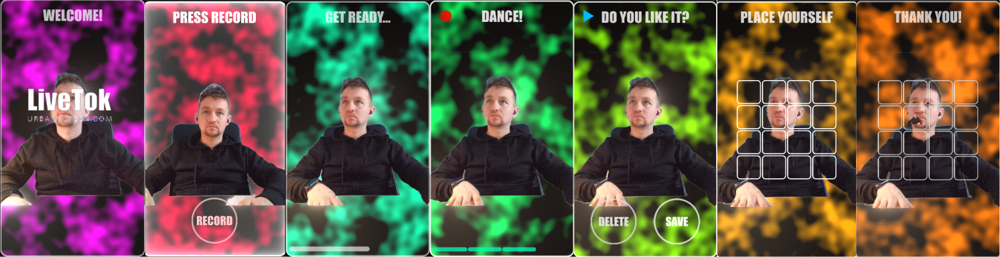

# liveTok - VideoLooper (2024)

**liveTok** is an interactive video looper prototype designed for public spaces with a touchscreen interface styled as a selfie camera. Developed as part of the **Digital Dialogues project** by Urbanscreen, liveTok captures short, synchronized video-dance fragments that are rhythmically aligned with audio loops. The tool was tested in various community contexts, including the **Residance workshop at Tenever Bremen** (1 September 2024).

## Key Features

### 1. **Interactive Video Recording Workflow**
- **State Machine Design**: A smooth step-by-step process from preparation to video saving:
  - **Welcome Screen**: Displays logo and welcome message.
  - **Mirror Camera Mode**: Prepares users with a live camera feed and a start button.
  - **Countdown**: Indicates the start of recording with visual and rhythmic cues.
  - **Recording**: Captures video synchronized with audio beats.
  - **Review & Save**: Allows users to accept, re-record, or delete videos.
  - **Slot Selection**: Assigns saved videos to slots on a projection grid, with options to overwrite or select empty slots.
  - **Thank You Screen**: Returns to the mirror-camera state.

### 2. **Beat-Synchronized Audio**
- Customizable audio loops segmented into stages:
  - Welcome, Countdown, Record, Decision, and Slot Selection.
- Synchronization ensures rhythmical consistency across all recorded and saved fragments.

### 3. **Efficient Video Caching & Synchronization**
- **Revolving Cache System**:
  - Stores recorded fragments temporarily in GPU memory for maximum performance.
  - Ensures seamless playback and synchronization by caching recordings before saving them to disk.

- **Python Extensions**:
  - Modularized video fragment handling.
  - Ensures synchronization, memory efficiency, and stability (e.g., no dropped frames).

### 4. **Externalized Class Design**
- Key operations are encapsulated in the `VideoLooper` class:
  - **State Machine**: Manages transitions between workflow stages.
  - **Cache Management**: Handles temporary storage and retrieval of video fragments.
  - **Core Methods**:
    - Countdown and timer operations.
    - Video recording, playback, and synchronization.
    - Saving videos to disk and file name-based length determination.
  - **Utility Functions**: Window handling, file randomization, and slot management.

## Requirements

- **Hardware**: High-performance server with at least 8GB of GPU memory (16GB recommended for optimal performance).
- **Software**: TouchDesigner with Python extensions.
- **Third-party Integration**: Based on mechanics inspired by L05's Video Loop Pedal ([link](https://forum.derivative.ca/t/video-loop-pedal/11631)).

## Community Test
**Residance Workshop at Tenever Bremen (1 September 2024)**  
- Event: LIVE TIK TOK - Digital Dance Workshop.  
- Collaborators: Urbanscreen & Magali from TanzkollektivBremen.  
- Details: Provided an engaging, interactive dance experience for children in a community setting.

## Future Directions
- Expanding slot grid functionality for larger projection systems.
- Enhancing synchronization with complex multi-instrument audio loops.
- Generalizing the tool for broader use cases in public art installations.

## External Resources
- [Kunstfestival Tenever 2024 Announcement](https://rausgegangen.de/en/events/kunstfestival-tenever-0/)

## Acknowledgments
This project builds on concepts from L05's **Video Loop Pedal** while extending functionality for high-performance GPU processing and real-time synchronization.

---

If you have questions or feedback, please contact **Slava Romanov** at [node@slavaromanov.art](mailto:node@slavaromanov.art).
